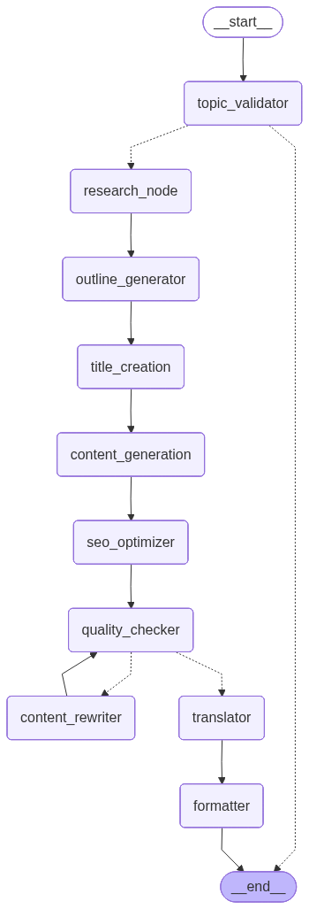
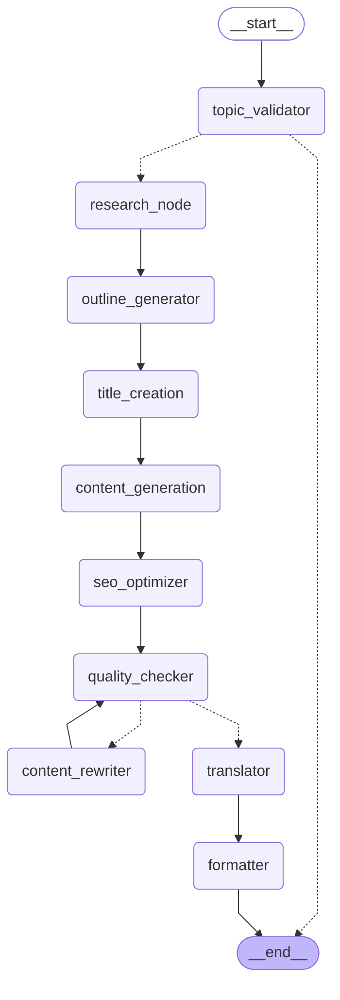

# Blog Generation Agent

An AI-powered, multi-node blog generation pipeline built with **LangGraph**, **LangChain**, **Groq LLM**, and **Tavily** for real-time web research. The pipeline validates topics, researches facts, generates structured outlines, writes content, optimizes for SEO, checks quality with auto-rewrite loops, translates, and formats the output — all exposed via a **FastAPI** REST API.

---

## 📋 Table of Contents

- [Features](#-features)
- [Architecture](#-architecture)
- [Tech Stack](#-tech-stack)
- [Project Structure](#-project-structure)
- [Prerequisites](#-prerequisites)
- [Installation](#-installation)
- [Environment Variables](#-environment-variables)
- [Running the App](#-running-the-app)
- [API Reference](#-api-reference)
- [LangGraph Studio](#-langgraph-studio)
- [Pipeline Flow](#-pipeline-flow)

---

## ✨ Features

| Feature | Description |
|---|---|
| 🔍 **Real-time Research** | Fetches up-to-date facts via Tavily web search before writing |
| 📝 **Structured Outline** | Generates a detailed outline before producing content |
| 🎯 **SEO Optimization** | Auto-generates keywords, meta description, URL slug, and tags |
| ✅ **Quality Gate** | Scores blog 1–10; auto-rewrites up to 3 times if score < 7 |
| 🌍 **Multi-language** | Translates blogs to any language (French, Tamil, Hindi, Spanish, etc.) |
| 📄 **Multiple Formats** | Returns output as `markdown`, `html`, or `json` |
| 🚫 **Topic Validation** | Rejects harmful or inappropriate topics before processing |
| ⚡ **Fast LLM** | Powered by Groq's high-speed inference engine |
| 🔬 **Visual Debugging** | Full graph visualization via LangGraph Studio |

---

## 🏗️ Architecture

### Graph Visualization



### Console Graph

```
╔══════════════════════════════════════════════════════════════════════╗
║           🤖  BLOG GENERATION AGENT  —  PIPELINE GRAPH              ║
╚══════════════════════════════════════════════════════════════════════╝

                          ┌───────────────┐
                          │    __start__  │
                          └───────┬───────┘
                                  │
                                  ▼
                    ┌─────────────────────────┐
                    │     topic_validator     │  ── Validates & refines topic
                    └────────────┬────────────┘
                                 │
              ╔══════════════════╩═══════════════════╗
              ║  conditional edge                    ║
              ▼                                      ▼
       ┌─────────────┐                 ┌─────────────────────────┐
       │   __end__   │ ◄── [invalid]   │      research_node      │  ── Tavily web search
       └─────────────┘                 └────────────┬────────────┘
                                                    │
                                                    ▼
                                       ┌────────────────────────┐
                                       │   outline_generator    │  ── Structured outline
                                       └────────────┬───────────┘
                                                    │
                                                    ▼
                                       ┌────────────────────────┐
                                       │    title_creation      │  ── SEO-friendly title
                                       └────────────┬───────────┘
                                                    │
                                                    ▼
                                       ┌────────────────────────┐
                                       │  content_generation    │  ── Full blog content
                                       └────────────┬───────────┘
                                                    │
                                                    ▼
                                       ┌────────────────────────┐
                                       │    seo_optimizer       │  ── Keywords, meta, slug
                                       └────────────┬───────────┘
                                                    │
                                                    ▼
                               ┌────────────────────────────────────┐
                               │          quality_checker           │  ── Score 1–10
                               └──────────────┬─────────────────────┘
                                              │
              ╔═══════════════════════════════╩══════════════════════════╗
              ║  conditional edge                                        ║
              ▼                                                          ▼
  ┌───────────────────────┐                              ┌──────────────────────────┐
  │    content_rewriter   │  ◄── [score < 7             │       translator         │  ◄── [score ≥ 7]
  │                       │       rewrites < 3]          │  (no-op if English)      │
  └───────────┬───────────┘                              └─────────────┬────────────┘
              │                                                        │
              └──────────────► quality_checker ◄──────── (loop ≤ 3)   │
                                                                       ▼
                                                          ┌────────────────────────┐
                                                          │       formatter        │  ── md / html / json
                                                          └────────────┬───────────┘
                                                                       │
                                                                       ▼
                                                               ┌──────────────┐
                                                               │   __end__    │
                                                               └──────────────┘

──────────────────────────────────────────────────────────────────────────────
  Legend:   ──►  direct edge        ══►  conditional edge       ◄──  loop
──────────────────────────────────────────────────────────────────────────────
  Nodes:    10 total  │  Conditional edges: 2  │  Max rewrites: 3
──────────────────────────────────────────────────────────────────────────────
```

### Mermaid Diagram




---

## 🛠️ Tech Stack

| Layer | Technology |
|---|---|
| **LLM** | [Groq](https://groq.com/) – `openai/gpt-oss-120b` via `langchain-groq` |
| **Orchestration** | [LangGraph](https://langchain-ai.github.io/langgraph/) – stateful multi-node graph |
| **Research** | [Tavily](https://tavily.com/) – real-time web search API |
| **Framework** | [LangChain](https://python.langchain.com/) – LLM abstractions & tools |
| **API Server** | [FastAPI](https://fastapi.tiangolo.com/) + [Uvicorn](https://www.uvicorn.org/) |
| **Validation** | [Pydantic v2](https://docs.pydantic.dev/) |
| **Package Manager** | [uv](https://github.com/astral-sh/uv) |
| **Observability** | [LangSmith](https://smith.langchain.com/) (optional) |

---

## 📁 Project Structure

```
Blog-Generation-Agent/
├── app.py                        # FastAPI application & REST endpoints
├── main.py                       # Entry point
├── requirement.txt               # Python dependencies
├── pyproject.toml                # Project metadata
├── langgraph.json                # LangGraph Studio config
├── .env                          # Environment variables (not committed)
└── src/
    ├── llms/
    │   └── groqllm.py            # Groq LLM initialization
    ├── states/
    │   └── blogstate.py          # BlogState TypedDict + Blog/SEOMeta models
    ├── nodes/
    │   └── blog_node.py          # All 10 pipeline node implementations
    └── graphs/
        └── graph_builder.py      # Graph wiring, edges, conditional routing
```

---

## ✅ Prerequisites

- Python **3.11+**
- [uv](https://github.com/astral-sh/uv) package manager
- A **Groq API key** → [console.groq.com](https://console.groq.com)
- A **Tavily API key** → [tavily.com](https://tavily.com)
- *(Optional)* A **LangSmith API key** → [smith.langchain.com](https://smith.langchain.com)

> ⚠️ **OneDrive users:** Set `UV_LINK_MODE=copy` to avoid hardlink errors.
> ```powershell
> [System.Environment]::SetEnvironmentVariable("UV_LINK_MODE", "copy", "User")
> ```

---

## 🚀 Installation

```bash
# 1. Clone the repository
git clone https://github.com/your-username/Blog-Generation-Agent.git
cd Blog-Generation-Agent

# 2. Install dependencies with uv
uv add -r requirement.txt

# Windows / OneDrive users:
$env:UV_LINK_MODE="copy"; uv add -r requirement.txt
```

---

## 🔑 Environment Variables

Create a `.env` file in the project root:

```env
# Required
GROQ_API_KEY=gsk_your_groq_api_key_here
TAVILY_API_KEY=tvly_your_tavily_api_key_here

# Optional – for LangSmith tracing
LANGCHAIN_API_KEY=ls_your_langsmith_key_here
LANGCHAIN_TRACING_V2=true
LANGCHAIN_PROJECT=Blog-Generation-Agent
```

| Variable | Required | Description |
|---|---|---|
| `GROQ_API_KEY` | ✅ | Groq LLM inference key |
| `TAVILY_API_KEY` | ✅ | Tavily real-time web search key |
| `LANGCHAIN_API_KEY` | ⬜ | LangSmith observability key |
| `LANGCHAIN_TRACING_V2` | ⬜ | Enable LangSmith tracing (`true`) |

---

## ▶️ Running the App

### FastAPI Server
```bash
# Windows
$env:UV_LINK_MODE="copy"; uv run python app.py

# macOS / Linux
uv run python app.py
```

Server starts at **http://localhost:8000**

- **Swagger UI** → http://localhost:8000/docs
- **ReDoc** → http://localhost:8000/redoc
- **Health check** → http://localhost:8000/health

### LangGraph Studio (Visual Debugger)
```bash
$env:UV_LINK_MODE="copy"; uv run langgraph dev
```
Opens the interactive graph visualization in your browser.

---

## 📡 API Reference

### `POST /blogs` — Generate a Blog Post

**Request Body**

```json
{
  "topic": "OpenText",
  "language": "English",
  "output_format": "markdown"
}
```

| Field | Type | Default | Description |
|---|---|---|---|
| `topic` | `string` | *required* | Subject of the blog post |
| `language` | `string` | `"English"` | Output language (e.g. `"French"`, `"Tamil"`, `"Hindi"`) |
| `output_format` | `string` | `"markdown"` | `"markdown"` \| `"html"` \| `"json"` |

**Response**

```json
{
  "status": "success",
  "topic": "OpenText",
  "language": "English",
  "output_format": "markdown",
  "quality_score": 9,
  "rewrite_count": 0,
  "seo": {
    "keywords": ["OpenText", "ECM", "enterprise content management", "EIM", "digital transformation"],
    "meta_description": "Explore how OpenText's AI-powered ECM solutions help enterprises manage, secure, and extract value from information at scale.",
    "slug": "opentext-enterprise-content-management-guide",
    "tags": ["OpenText", "ECM", "LangChain", "AI", "Enterprise"]
  },
  "blog": {
    "title": "# Unlocking Digital Transformation with OpenText 🚀",
    "content": "## Introduction\n\n...",
    "word_count": 1240,
    "reading_time_minutes": 6
  },
  "formatted_output": "# Unlocking Digital Transformation...\n\n## Introduction\n..."
}
```

**Example curl**

```bash
curl --location --request POST 'http://localhost:8000/blogs' \
--header 'Content-Type: application/json' \
--data-raw '{
    "topic": "OpenText",
    "language": "English",
    "output_format": "markdown"
}'
```

**Error Responses**

| Status | Reason |
|---|---|
| `400` | Empty topic or unsupported output_format |
| `422` | Topic failed validation (harmful/inappropriate) |
| `500` | Internal server error |

---

### `GET /health` — Health Check

```bash
curl http://localhost:8000/health
# {"status": "ok", "version": "2.0.0"}
```

---

## 🔬 LangGraph Studio

The `langgraph.json` config exposes the compiled graph for visual debugging:

```json
{
    "dependencies": ["."],
    "graphs": {
        "blog_generator_agent": "./src/graphs/graph_builder.py:graph"
    },
    "env": "./.env"
}
```

Run `uv run langgraph dev` to launch Studio, where you can:
- 👁️ Visualize the full graph with all nodes and edges
- ▶️ Run the graph interactively with custom inputs
- 🔍 Inspect each node's input/output state step-by-step
- 🔁 Replay and debug individual runs

---

## 🔄 Pipeline Flow

| Step | Node | What Happens |
|---|---|---|
| 1 | `topic_validator` | LLM checks if topic is safe & refines it |
| 2 | `research_node` | Tavily fetches 5 real-time web sources |
| 3 | `outline_generator` | LLM creates a structured Markdown outline |
| 4 | `title_creation` | LLM generates one SEO-friendly title |
| 5 | `content_generation` | LLM writes full blog using outline + research |
| 6 | `seo_optimizer` | LLM extracts keywords, meta, slug, tags |
| 7 | `quality_checker` | LLM scores blog 1–10; routes to rewriter if < 7 |
| 8 | `content_rewriter` | *(conditional)* LLM rewrites based on feedback |
| 9 | `translator` | *(conditional)* LLM translates if language ≠ English |
| 10 | `formatter` | Converts to final markdown / html / json |

---

## 📝 License

MIT License — feel free to use, modify, and distribute.
